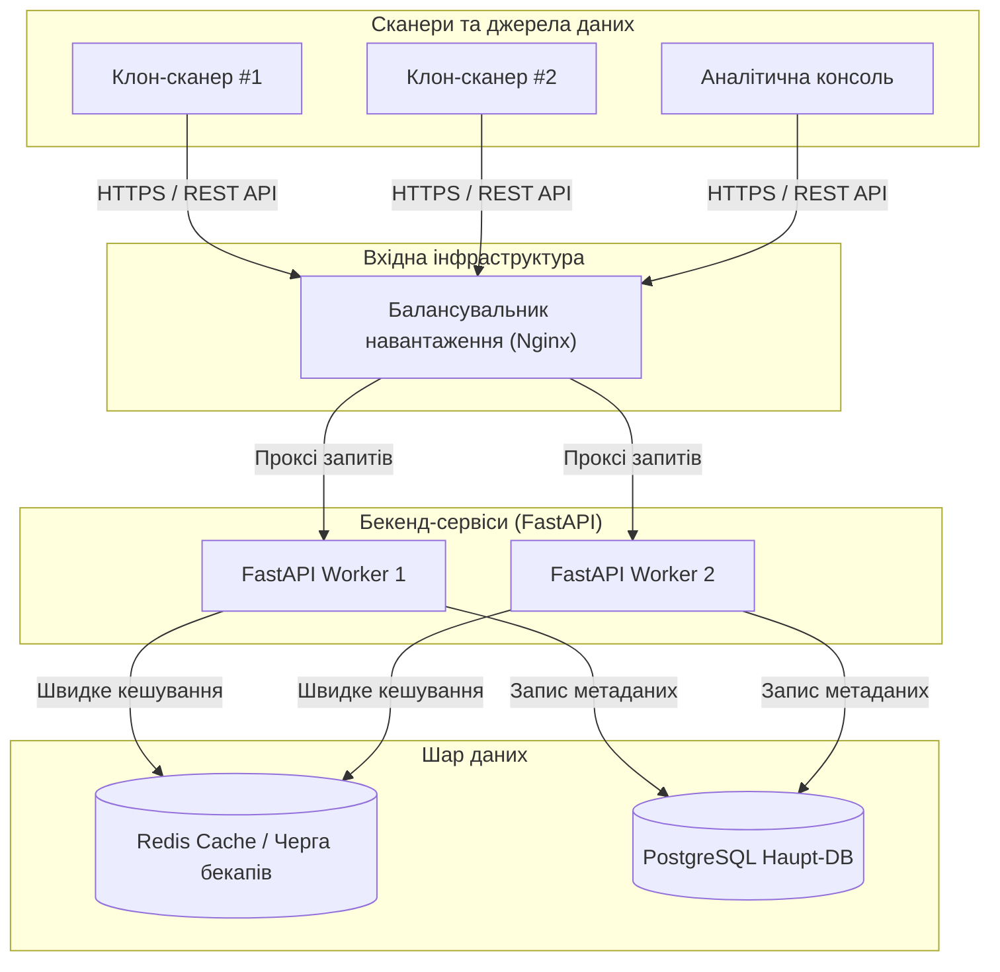
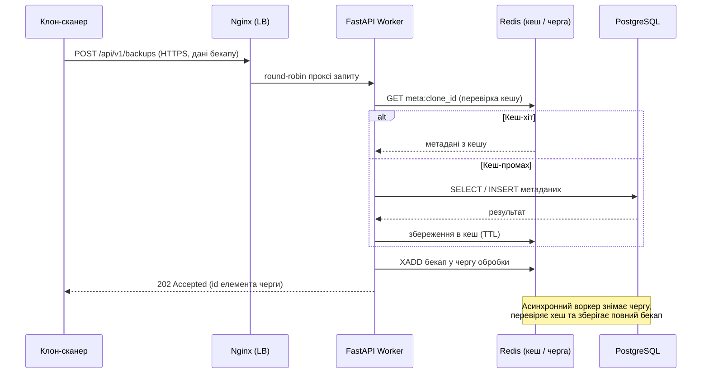
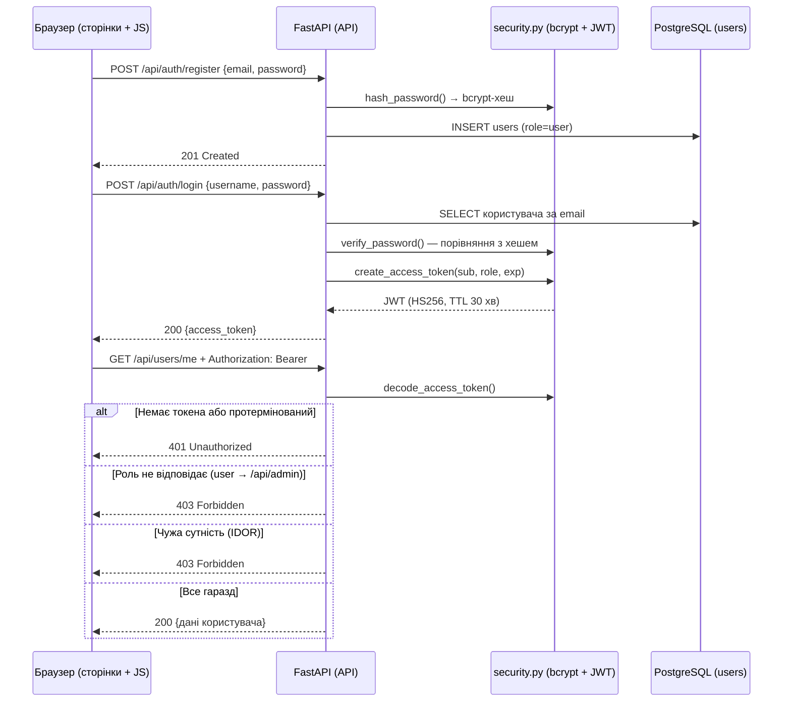

# Архітектура системи Synclone

Система **Synclone** — синхронізатор пам'яті для клонів — є прикладом
Data-Intensive Application: головне завдання — приймати безперервний потік
бекапів свідомості мільйонів мешканців (великий обсяг + висока швидкість зміни
даних) та надавати ці дані за запитом без втрати продуктивності.

## 1. Схема архітектури

## 2. Діаграма послідовності взаємодії

## 3. Опис взаємодії компонентів

1. **Клієнти → Балансувальник.** Сканери свідомості та аналітична консоль
   надсилають REST-запити через HTTPS. Nginx виконує round-robin розподіл
   між воркерами, термінацію TLS, обмеження швидкості (rate limit) та
   health-check — жоден воркер не перевантажується, доки є здорові вузли.
2. **Балансувальник → Бекенд.** Воркери FastAPI stateless: не зберігають
   стан між запитами, тому їх легко додавати (горизонтальне масштабування).
   Кожен запит потрапляє до вільного воркера.
3. **Бекенд → Redis (кеш).** Перед зверненням до БД воркер шукає метадані
   в кеші (`meta:{clone_id}`). Кеш-хіт відповідає за мілісекунди та знімає
   навантаження з PostgreSQL; TTL обмежує життя записів, а при новому бекапі
   запис інвалідується (write-through).
4. **Бекенд → PostgreSQL.** Джерело істини: таблиця `memory_backups`
   (`clone_id`, `memory_hash`, `size_mb`, `created_at`). Хеш дозволяє
   дедуплікувати бекапи. Записи партиціонуються за `clone_id` та часом для
   швидких діапазонних запитів.
5. **Бекенд → Redis (черга).** Важкі повні бекапи не обробляються всередині
   HTTP-запиту: воркер кладе подію в чергу (Redis Streams), відповідає
   `202 Accepted`, а асинхронний воркер обробляє чергу окремо — потік прийому
   не зупиняється.
6. **Зворотний шлях.** Аналітична консоль отримує метадані з кешу/БД та
   завантажує потрібний бекап зі сховища.

## 4. Стратегія кешування

- Ключі: `meta:{clone_id}`, `hash:{memory_hash}`; значення — серіалізовані
  метадані бекапу.
- TTL ~5 хв для гарячих даних; інвалідація ключа при отриманні нового бекапу.
- Кеш знімає з PostgreSQL читаюче навантаження (аналітичні запити, перевірки
  дублікатів за хешем).

## 5. Балансування навантаження

- **Зовнішнє:** Nginx між API-воркерами (round-robin / least-connections).
- **Внутрішнє:** черга розподіляє обробку бекапів між воркерами обробки.
- Оскільки воркери stateless, балансування масштабується шляхом додавання
  реплік (scale-out) без зупинки сервісу.

## 6. Масштабування та відмовостійкість

- Стан винесено з бекенду в Redis та PostgreSQL → бекенд масштабується
  горизонтально.
- PostgreSQL: primary + репліка для читань; Redis: master/replica + persistence.
- Health-check кожного вузла; нездоровий вузол відключається від
  балансування автоматично.

## 7. Реалізація на етапі каркасу vs продакшен

| Компонент   | Архітектура (прод) | Каркас (зараз)              | Як перемкнути                        |
|-------------|--------------------|-----------------------------|--------------------------------------|
| РБД         | PostgreSQL         | PostgreSQL у Docker (`synclone-pg`); без `.env` — SQLite | `DATABASE_URL` у `.env`              |
| Кеш / черга | Redis              | ще не підключено (етапи далі) | налаштування `REDIS_URL`           |
| Балансування| Nginx              | uvicorn (один процес)       | docker-compose / конфіг Nginx        |

Драйвер `psycopg2-binary` уже встановлено та додано до `requirements.txt`.
PostgreSQL запускається в Docker-контейнері `synclone-pg` (порт 5432; створення
користувача та бази — через змінні `POSTGRES_*`, без ручних SQL-команд).
Конфігурація уніфікована: `app/core/config.py` читає `DATABASE_URL` з `.env`,
тому зміна одного рядка перемикає застосунок між PostgreSQL і SQLite без зміни
коду.

## 8. Обґрунтування технологій

- **FastAPI** — async-підтримка, висока пропускна здатність I/O-операцій,
  автоматична документація OpenAPI.
- **SQLAlchemy** — шар абстракції над РБД: SQLite на етапі каркасу, PostgreSQL
  у проді без змін коду.
- **Redis** — низькозатратний кеш і черга в одному компоненті.
- **Nginx** — перевірений балансувальник із TLS-термінацією.
- **PostgreSQL** — транзакційна РБД із підтримкою партиціонування великих
  таблиць.

## 9. Авторизація та безпека (JWT)

### Діаграма реєстрації, входу та захисту маршрутів

### Обґрунтування архітектурних рішень

| Рішення | Чому саме так |
|---------|----------------|
| **JWT (OAuth2 Bearer) замість сесій у cookie** | API-first: сервер не зберігає стан (stateless) — масштабується разом із воркерами без спільного сховища сесій; той самий токен використовують і сторінки, і майбутні клієнти (мобільний, CLI) |
| **401 vs 403** | 401 = «хто ти?» (немає токена, протермінований, невірний логін) + заголовок `WWW-Authenticate`; 403 = «ти відомий, але заборонено» (чужа роль, чужий ресурс) |
| **bcrypt (pwdlib)** | соль + адаптивна вартість обчислень; у БД — лише хеш |
| **PyJWT, HS256, TTL 30 хв** | мінімальна залежність; фіксований алгоритм (захист від `alg: none`); коротке життя токена звужує вікно викрадення |
| **Секрет `JWT_SECRET` у `.env` (>= 32 байти)** | ніколи в коді; файл у `.gitignore` |
| **Ролі в таблиці `users.role`** | просто й інспектується SQL; зміна ролі — один `PATCH` адміністратором |
| **Двошаровий захист** | вертикальний: `require_role("admin")` на рівні роутера; горизонтальний: перевірка власника сутності в handler — відповідь **403, а не 404**, щоб не розкривати існування чужих ID |
| **Автосід адміністратора з `.env`** | жодного публічного ендпоінта створення адмінів — немає діри «перехоплення адмінки» |
| **Токен у localStorage** | просто для статичних сторінок; ризик XSS звужено коротким TTL; вихід = видалення токена на клієнті |
| **Окрема тестова БД `synclone_test`** | тести ніколи не псують робочі дані; створення та очищення — автоматичні фікстури pytest |

### Сценарії тестів (додаткове завдання)

| Сценарій | Очікувана відповідь | Файл тесту |
|----------|---------------------|------------|
| Анонім на захищений маршрут | **401** Unauthorized | `tests/test_anonymous.py` |
| Успішний вхід / невірний логін чи пароль | **200** + дані / **401** | `tests/test_auth.py` |
| Вертикальне розмежування: `user` на адмін-панель | **403** Forbidden | `tests/test_roles.py` |
| Горизонтальне розмежування (IDOR): чужі дані | **403** Forbidden | `tests/test_idor.py` |
