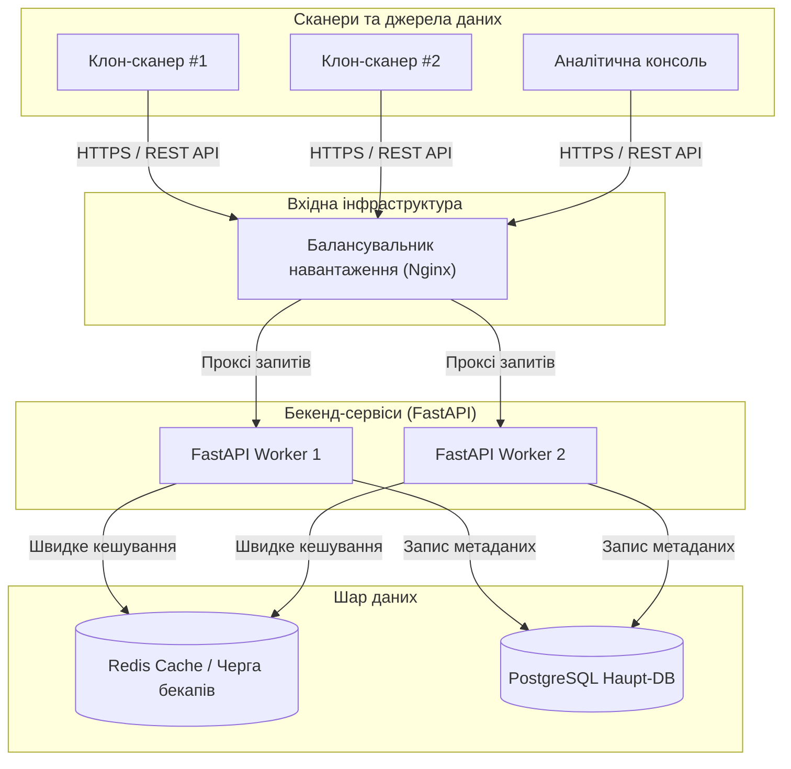

# Архітектура системи Synclone

```mermaid
graph TD
    subgraph Clients["Сканери та джерела даних"]
        C1["Клон-сканер #1"]
        C2["Клон-сканер #2"]
        C3["Аналітична консоль"]
    end

    subgraph Edge["Вхідна інфраструктура"]
        LB["Балансувальник навантаження (Nginx)"]
    end

    subgraph Backend["Бекенд-сервіси (FastAPI)"]
        API1["FastAPI Worker 1"]
        API2["FastAPI Worker 2"]
    end

    subgraph Storage["Шар даних"]
        Cache[("Redis Cache / Черга бекапів")]
        DB[("PostgreSQL Haupt-DB")]
    end

    C1 -->|HTTPS / REST API| LB
    C2 -->|HTTPS / REST API| LB
    C3 -->|HTTPS / REST API| LB

    LB -->|Проксі запитів| API1
    LB -->|Проксі запитів| API2

    API1 -->|Швидке кешування| Cache
    API2 -->|Швидке кешування| Cache

    API1 -->|Запис метаданих| DB
    API2 -->|Запис метаданих| DB
```
